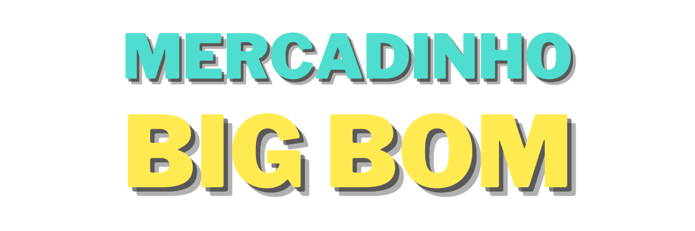
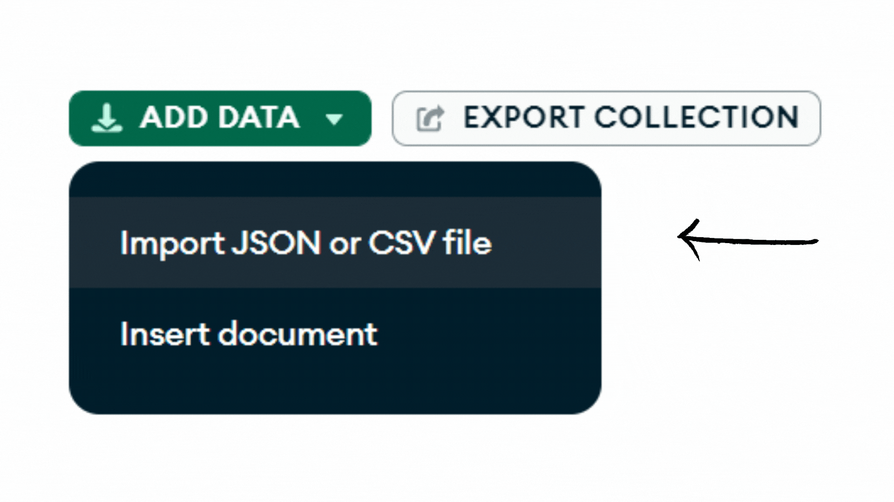

<div align="center"></div>

## Recursos utilizados:
- Node.js
- MongoDB
- Express.js
- Typegoose
- HTML, CSS e JS

## CRUD:

### Create - Cadastro dos produtos
<div align="center"></div>

### Read - Listagem e filtro dos produtos
<div align="center"></div>

### Update - Alteração dos produtos
<div align="center"></div>

### Delete - Eliminação dos produtos
<div align="center"></div>

## Guia de uso

1. Tenha instalado na sua máquina:
- [Node.js](https://nodejs.org/en/download)
- [MongoDB](https://www.mongodb.com/try/download/community)

2. Clone o repositório.

3. Abra o terminal e acesse a pasta crud:
```bash
  cd aqui-vai-o-caminho
```

4. Instale todas as dependências necessárias para a execução digitando a seguinte instrução:
```bash
  npm install
```

5. Depois basta inicializar através do comando:
```bash
  npm run dev
```

6. Se quiser ter o projeto com produtos cadastrados, importe o arquivo "products.json" na collection products. O [MongoDB Compass](https://www.mongodb.com/try/download/compass) facilita muito esse processo, seu uso é recomendado.

<div align="center"></div>
<br>
7. Por fim, abra o arquivo "index.html" na pasta chamada interface.
<br><br>
E voilà! 👌


    
